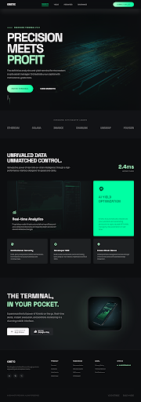
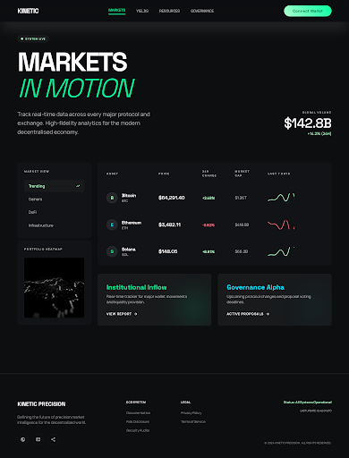
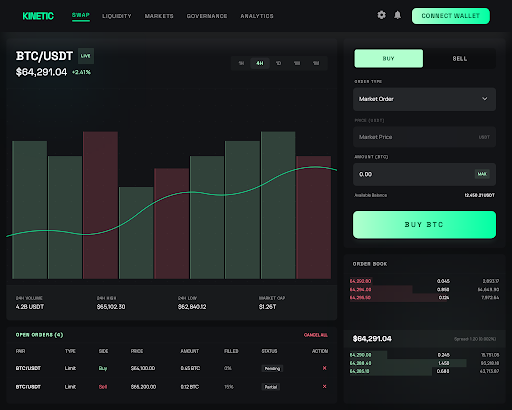
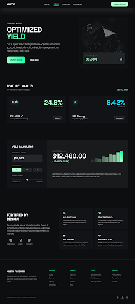
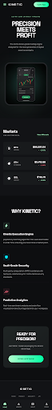

# stitch-pipeline

**Turn product visions into production-ready, accessibility-hardened React/Vue/Svelte components — entirely within Claude Code.**

A [Claude Code](https://docs.anthropic.com/en/docs/claude-code) plugin that orchestrates a 5-stage design-to-code pipeline using [Google Stitch](https://stitch.google.com/) MCP. Describe what you want to build, and the pipeline generates screens, pulls assets, decomposes them into atomic components, and hardens everything for WCAG accessibility.

`Claude Code Plugin` | `7 Skills` | `MIT License` | `Google Stitch MCP`

---

## Pipeline

```
  "Build me a crypto analytics dashboard"
                    │
                    ▼
  ┌─────────────────────────────────┐
  │  /stitch-init                   │
  │  MCP verification, tech stack   │
  │  detection, design system setup │
  └───────────────┬─────────────────┘
                  │
                  ▼
  ┌─────────────────────────────────┐
  │  /stitch-generate               │
  │  AI-generate screens in Stitch  │
  │  (desktop + mobile variants)    │
  └───────────────┬─────────────────┘
                  │
                  ▼
  ┌─────────────────────────────────┐
  │  /stitch-pull                   │
  │  Fetch HTML + PNG assets via    │
  │  haiku subagents (context-      │
  │  efficient)                     │
  └───────────────┬─────────────────┘
                  │
                  ▼
  ┌─────────────────────────────────┐
  │  /stitch-convert                │
  │  Atomic design decomposition    │
  │  into framework components      │
  └───────────────┬─────────────────┘
                  │
                  ▼
  ┌─────────────────────────────────┐
  │  /stitch-harden                 │
  │  3-pass WCAG accessibility      │
  │  audit + interactive states     │
  └───────────────┬─────────────────┘
                  │
                  ▼
  ┌─────────────────────────────────┐
  │  /stitch-status                 │
  │  Progress dashboard at any time │
  └─────────────────────────────────┘
```

---

## Quick Start

### 1. Install the plugin

```bash
curl -fsSL https://raw.githubusercontent.com/sachin1245/stitch-pipeline/main/install.sh | bash
```

Or manually:

```bash
git clone https://github.com/sachin1245/stitch-pipeline.git ~/.claude/plugins/stitch-pipeline
```

### 2. Set up Google Stitch MCP (one-time)

```bash
claude mcp add stitch-mcp -s user \
  -e GOOGLE_CLOUD_PROJECT=stitch-96cd6 \
  -- npx -y stitch-mcp-auto
```

Then authenticate:

```bash
gcloud auth application-default login
```

### 3. Run the pipeline

Restart Claude Code, open any project, and run:

```
/stitch-pipeline
```

Or run individual stages:

```
/stitch-init
/stitch-generate
/stitch-pull
/stitch-convert
/stitch-harden
/stitch-status
```

---

## Commands

| Command | What it does | When to use |
|---------|-------------|-------------|
| `/stitch-init` | Verify MCP, detect tech stack, create/link Stitch project, set up design system, create `.stitch-claude/` tracking | Starting a new project or onboarding an existing one |
| `/stitch-generate` | Generate UI screens in Stitch from text descriptions (desktop + mobile) | When you have screen descriptions ready |
| `/stitch-pull` | Fetch HTML + PNG assets to local `stitch-assets/` via haiku subagents | After screens are generated in Stitch |
| `/stitch-convert` | Decompose assets into atoms, molecules, organisms, layouts, pages | After assets are pulled locally |
| `/stitch-harden` | 3-pass accessibility audit: quick wins, widget patterns, full WCAG checklist | After components are created |
| `/stitch-status` | Full pipeline dashboard with progress, component inventory, next actions | Any time |
| `/stitch-pipeline` | End-to-end orchestrator — chains all stages with confirmation at each step | Full pipeline run (interactive, auto, or selective mode) |

---

## Demo: Kinetic Precision

A crypto analytics dashboard built entirely through this pipeline.

**Tech stack:** React 19 + Vite 8 + Tailwind CSS v4 + React Router DOM

| Metric | Value |
|--------|-------|
| Screens tracked | 37 |
| Pages created | 19 |
| Layouts (desktop + mobile) | 37 |
| Shared components | 18 |
| Accessibility issues fixed | 65+ |
| Design token consistency | 9/10 |

### Screenshots



<details>
<summary>More screenshots</summary>










</details>

See [examples/kinetic-precision/](examples/kinetic-precision/) for full tracking data (screens.md, components.md, hardening-log.md).

---

## How It Works

### Skills Chain

Each skill is an independent SKILL.md file that Claude Code loads on demand. Skills can run individually or be chained by the `/stitch-pipeline` orchestrator. The orchestrator detects the current project state and resumes from wherever the pipeline left off.

### Per-Project Tracking

Every project gets a `.stitch-claude/` directory that tracks the full pipeline state:

```
.stitch-claude/
├── project.md          # Tech stack, Stitch IDs, design system
├── screens.md          # Screen inventory with lifecycle status
├── components.md       # Component library (atoms → pages)
├── design-system.md    # Token sync status
└── hardening-log.md    # Record of a11y fixes applied
```

### Screen Lifecycle

Each screen progresses through 5 statuses:

```
planned → generated_in_stitch → assets_pulled → component_converted → hardened
```

The pipeline never advances a screen's status unless the stage completes successfully. The SessionStart hook prints a one-line status summary whenever you open a Stitch project.

### Atomic Design Decomposition

Components are organized into 5 levels during `/stitch-convert`:

```
Pages          Route-level responsive switch (desktop/mobile)
  └── Layouts  Full-screen composition for one variant
       └── Organisms  Self-contained sections (nav, card groups, data panels)
            └── Molecules  Small groups of atoms (stat card, chart widget)
                 └── Atoms  Single-purpose elements (icon, badge, avatar)
```

Shared components (SideNav, BottomNav, TopNav, FAB) are created once and reused across all layouts.

### Accessibility Hardening

The `/stitch-harden` skill runs a 3-pass audit on every component:

1. **Quick Wins** (~80% of issues): icon-only buttons need `aria-label`, every interactive element needs `focus-visible`, multiple `<nav>` need unique labels, lists need `role="list"`, status indicators need `sr-only` text
2. **Widget Patterns**: toggle switches (`role="switch"`), tab interfaces (`role="tablist"`), radio groups (`<fieldset>` + `<legend>`), dangerous action buttons (`aria-describedby`)
3. **Full Checklist**: interactive elements, focus management, navigation, forms, headings, semantic lists, data visualizations, touch targets, images

---

## Supported Frameworks

| Framework | Config Detection | Component Pattern |
|-----------|-----------------|-------------------|
| React + Vite | `vite.config.*` + `react` in deps | Function components + `useMediaQuery` hook |
| React + Next.js | `next.config.*` | App Router, Server Components, `'use client'` |
| Vue + Vite | `vite.config.*` + `vue` in deps | `<script setup lang="ts">` SFC |
| Vue + Nuxt 3 | `nuxt.config.*` | File-based routing, `definePageMeta` |
| SvelteKit | `svelte.config.*` | `+page.svelte`, Svelte stores |

The plugin auto-detects your framework and generates components matching its conventions.

---

## Example Output

After running the pipeline, `screens.md` tracks every screen:

```markdown
| Screen | Variant | Stitch ID | Status | HTML Asset | PNG Asset | Component | Updated |
|--------|---------|-----------|--------|------------|-----------|-----------|---------|
| Home | desktop | f7b073... | hardened | html/app-home-desktop.html | screenshots/app-home-desktop.png | DesktopHome | 2026-04-03 |
| Home | mobile | 08923... | hardened | html/app-home-mobile.html | screenshots/app-home-mobile.png | MobileHome | 2026-04-03 |
| Markets | desktop | 2938c4... | component_converted | html/app-markets-desktop.html | screenshots/app-markets-desktop.png | DesktopMarkets | 2026-04-03 |
```

And `components.md` catalogs the component library:

```markdown
## Atoms
| Component | File | Used By |
|-----------|------|---------|
| Icon | components/Icon.tsx | SideNav, BottomNav, TopNav |

## Organisms
| Component | File | Used By |
|-----------|------|---------|
| SideNav | components/SideNav.tsx | All Desktop layouts |
| BottomNav | components/BottomNav.tsx | All Mobile layouts |
```

---

## Roadmap

### Next Release

- **State management patterns** — Data fetching hooks, loading/error states, API integration templates
- **Batch scaling** — Pagination and filtering for 100+ screen projects
- **Design system import** — Sync with existing Figma tokens, Material Design, or custom design systems
- **Automated verification** — Visual regression testing and axe-core a11y automation post-conversion

### Planned

- **Incremental updates** — Re-pull changed designs without losing manual edits (three-way merge)
- **Team workflows** — Branch strategies and conflict resolution for parallel conversion
- **CI/CD integration** — Webhooks, automated triggers, approval gates
- **Theme variants** — Light/dark mode, white-labeling, A/B test variants
- **Storybook generation** — Auto-generate component documentation from the library

---

## Prerequisites

- [Claude Code](https://docs.anthropic.com/en/docs/claude-code) CLI
- [Google Stitch MCP](https://stitch.google.com/) server configured at user scope
- Google Cloud authentication (`gcloud auth application-default login`)
- A frontend project using one of the supported frameworks

---

## How the Plugin Works (for contributors)

This plugin is **pure markdown and shell scripts** — no compiled code, no dependencies, no build step.

```
stitch-pipeline/
├── .claude-plugin/        Plugin metadata (name, version, author)
├── hooks/                 SessionStart hook (status line on session open)
├── skills/                7 SKILL.md files (YAML frontmatter + markdown instructions)
└── references/            4 reference docs loaded by skills on demand
```

Each skill is a single `SKILL.md` file with YAML frontmatter (name, description, triggers) and markdown body (workflow instructions that Claude Code follows). Skills reference the `references/` docs for detailed checklists and templates.

---

## Contributing

1. Fork this repo
2. Create a feature branch
3. Edit or add skills in `skills/`
4. Test by running the skill in Claude Code
5. Submit a PR

See the [references/](references/) directory for the tracking schema, hardening checklist, atomic design rules, and framework templates that skills use.

---

## License

[MIT](LICENSE)
